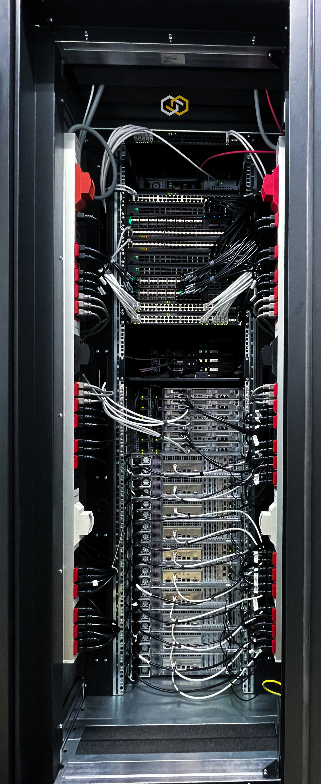

# Documentation of the SCS Hardware Landscape

## Purpose of this repository

This Git repository documents, configures and automates the management and setup of the Sovereign Cloud Stack hardware environment.
This environment is build in the context of the VP18 project workpackage and in running at a colocation of [JH Computers](https://jh-computers.de/).

The main goals of this environment are:

* Runtime environment for the blueprint of the "SCS Turnkey Solution"
  * Run, test and demontrate all components
  * Demonstration showroom for interested parties
    (A blueprint for potential SCS operators to get an idea of the OSISM setup)
  * Training and demonstration environment
  * Testing of new releases
    (Environment for the future execution of QA tests)
  * Reproduce and analyze production problems on a real system
  * Develop and test topics that can only be analyzed, tested or reproduced on a real system
  * Dogfooding / continuous operation with real workload
  * Develop operational procdures
  * Develop and test certification tests
* Provide a network testing lab for:
  * Switch/network automation
  * Sonic packaging
  * Evaluating network architecture concepts
  * Test environment to evaluate and test concepts and implementations in layer-3 underlay networking with SONiC
  * Test environment to evaluate and test improvements to the monitoring stack
* Run a "production-like" experimentation and testing plattform

## A visual impression

<div style="display: flex">
    &nbsp;
    
</div>

## References

* Standards
  * [Hostname Naming](documentation/standards/Hostname_Naming.md)
  * [Network Connections](documentation/standards/System_Network_Connections.md)
* Documentation of the System
  * Operational procedures
    * [How to get access to the environment](documentation/System_Runbooks.md#how-to-get-access)
    * [Start to work with the environment](documentation/System_Usage.md)
    * [Deployment of the System(s)](documentation/System_Deployment.md)
    * [Runbooks](documentation/System_Runbooks.md)
    * [Operational Procedures](documentation/System_Operational_Workflows.md)
  * Documentation of the system setup
    * [The rack configuration](documentation/System_Rack_Setup.md)
    * [General Network Information](documentation/System_Networks.md)
    * [The Networking Diagram](documentation/System_Network_Diagram.md)
    * [Detailed Description of the Network Wireing](documentation/System_Network_Wireing.md)
    * [Detailed Description of the Power Wireing](documentation/System_Power_Wireing.md)
    * Hardware Devices
      * Networking Equipment
        * [Edgecore 7326-56X-O-AC-B](documentation/devices/network/Edgecore_7326-56X-O-AC-B.md)
        * [Edgecore 5835-54X-O-AC-B](documentation/devices/network/Edgecore_5835-54X-O-AC-B.md)
        * [Edgecore 4630-54TE-O-AC-B](documentation/devices/network/Edgecore_4630-54TE-O-AC-B.md)
        * [Edgecore 7726-32X-O-AC-B](documentation/devices/network/Edgecore_7726-32X-O-AC-B.md)
      * Server Equipment
        * [Supermicro H12SSL-NT](documentation/devices/servers/Supermicro_H12SSL-NT.md)
        * [Supermicro H12SSL-CT](documentation/devices/servers/Supermicro_H12SSL-CT.md)
        * [Supermicro ARS-110M-NR](documentation/devices/servers/Supermicro_ARS-110M-NR.md)
        * [Supermicro A2SDV-4C-LN8F](documentation/devices/servers/Supermicro_A2SDV-4C-LN8F.md)
        * [Supermicro A2SDV-8C-LN8F](documentation/devices/servers/Supermicro_A2SDV-8C-LN8F.md)
* Other documentation
  * SONiC
    * [FAQ for SONiC](documentation/sonic/FAQ_SONiC.md)
    * [SONiC Testing Environment](documentation/sonic/SONiC_Testing.md)


## Environment Links

### Zone 1 Environment

:::info

This is list is incomplete.

:::

| Name                     | URL                                                                | Username     | Password Key                     | Note            |
|:-------------------------|:-------------------------------------------------------------------|:-------------|:---------------------------------|:----------------|
| DNS Management           | https://portal.cnds.io                                             | <personal>   |                                  |                 |
| Horizon (via Keystone)   | https://api.zone1.landscape.scs.community                          | admin        | keystone_admin_password          | domain: default |
| Horizon (via Keystone)   | https://api-internal.zone1.landscape.scs.community                 | admin        | keystone_admin_password          | domain: default |
| ARA                      | https://ara.zone1.landscape.scs.community:8120                     | ara          | ara_password                     |                 |
| Ceph                     | http://api-internal.zone1.landscape.scs.community:7000             | admin        | ceph_dashboard_password          |                 |
| Grafana                  | https://grafana.zone1.landscape.scs.community:3000                 | admin        | grafana_admin_password           |                 |
| Keycloak                 | https://keycloak.zone1.landscape.scs.community/auth                | admin        |                                  | not installed   |
| Netbox                   | https://netbox.zone1.landscape.scs.community                       | admin        | netbox_superuser_password        |                 |
| Netdata                  | http://testbed-manager.zone1.landscape.scs.community:19999         |              |                                  | not active      |
| OpenSearch Dashboards    | https://opensearch.zone1.landscape.scs.community:5601              | opensearch   | opensearch_dashboards_password   |                 |
| Prometheus               | https://prometheus.zone1.landscape.scs.community:9091              | admin        | prometheus_password              |                 |
| Prometheus Alertmanager  | https://prometheus-alertmanager.zone1.landscape.scs.community:9091 | admin        | prometheus_alertmanager_password |                 |
| RabbitMQ                 | https://rabbitmq.zone1.landscape.scs.community:15672               | openstack    | rabbitmq_password                |                 |
| phpMyAdmin               | https://phpmyadmin.zone1.landscape.scs.community                   | root         | database_password                |                 |
| Webserver                | http://files.zone1.landscape.scs.community:18080/                  | n/a          | n/a                              | Install Files   |
| HAProxy (testbed-node-0) | http://st01-ctl-r01-u27.zone1.landscape.scs.community:1984         | openstack    | haproxy_password                 |                 |
| HAProxy (testbed-node-1) | http://st01-ctl-r01-u28.zone1.landscape.scs.community:1984         | openstack    | haproxy_password                 |                 |
| HAProxy (testbed-node-2) | http://st01-ctl-r01-u29.zone1.landscape.scs.community:1984         | openstack    | haproxy_password                 |                 |

You can gather the passwords using the following command:
(see also information about vault in the [System Runbook](documentation/System_Runbooks.md)
```
./landscape_ctl -o -s <key>
./landscape_ctl -o -s keystone_admin_password

```
