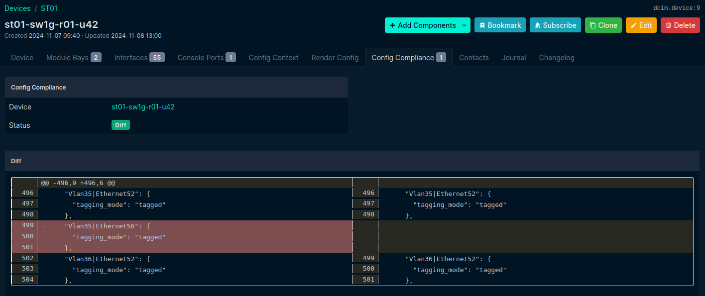
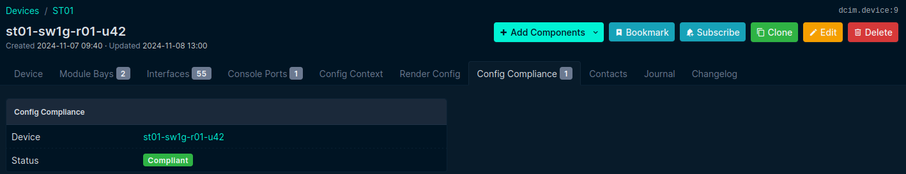
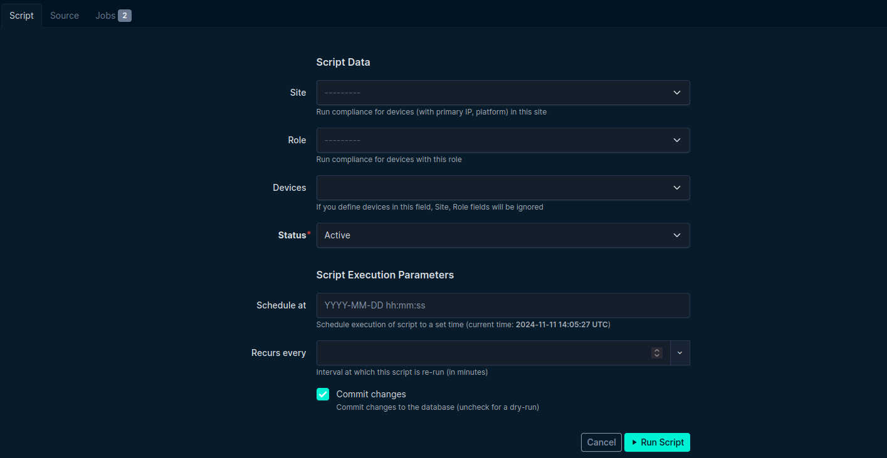
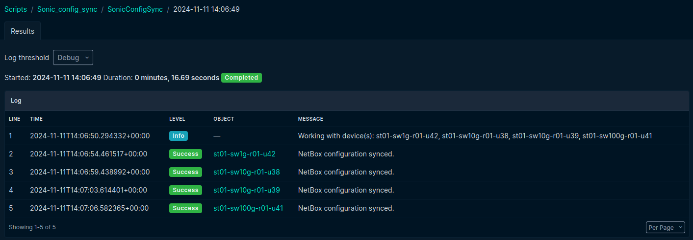

# Automation of SONiC switch provisioning and management using Netbox as a single source of truth

This document explains our use of ZTP, ONIE, and NetBox to enable fully automated provisioning and management of
network switches with the SONiC NOS.

## Provisioning


The architecture for automatic provisioning and management of SONiC switches consists of following:

### DHCP server

It provides the initial network configuration for newly connected switches, as well as options for ONIE and ZTP.
Through these options, ONIE is directed to download the SONiC image, while ZTP retrieves the configuration necessary
for the switch from the NetBox.
The DHCP server can employ various configuration strategies, such as using the vendor-class-identifier to filter devices.
Some of these strategies are detailed in [ZTP docs](ZTP.md) and [ONIE docs](ONIE.md).

The following is an example configuration that has been applied as a DHCP configuration in the SCS LAB environment:
```text
host st01-sw1g-r01-u42 {
  hardware ethernet d0:77:ce:2b:59:c4;
  server-name "st01-sw1g-r01-u42.mgmt.landscape.scs.community";
  option host-name "st01-sw1g-r01-u42";
  fixed-address 10.10.23.103;
  # This option is intended for use in a LAB environment only, as it directs ONIE to install
  # a custom SONiC image built by the SCS community. For more details, refer to:
  # https://github.com/SovereignCloudStack/sonic-buildimage/pull/4
  option default-url "http://10.10.23.254:28080/sonic-fix_edgecore.0-10b4356bf.bin";
  # This option is intended for use in a LAB environment only, as it instructs ZTP to apply `ztp.json` bootfile
  option bootfile-name "http://10.10.23.254:28080/ztp.json";
  }
```

### HTTP server

It serves as storage for the SONiC image, ZTP configuration, and associated scripts.
It should be accessible from the target network device and allows to download assets needed by ONIE and ZTP.

### NetBox

It serves as the source for the initial configuration of SONiC switches, which is downloaded through the ZTP process.
It also contains scripts for automating further configuration and management of SONiC switches.

The initial configuration is composed of three parts: a configuration template, the device’s state as defined in NetBox,
and the configuration context that defines some static definitions like IP addresses of NTP servers.

    Config context       NetBox device state
           |                    |
           v                    v
         --------------------------------
        | SONiC configuration template   |
         --------------------------------
                     |
                     v
           ------------------------
          |   SONiC configuration  |
           ------------------------

The [current template](../../netbox/config_templates/sonic_config.json.j2) for SONiC configuration includes the basic setup for the switch, with minimal configuration
necessary for setting up elements such as port channels, VLANs, and BGP unnumbered using peer groups, and more.
The SONiC configuration is retrieved from NetBox via its API, based on the device's hostname provided by the DHCP server.

## Management

NetBox is also used for additional switch configuration based on changes made directly by the administrator in NetBox.
Currently, this functionality is in an MVP stage, so it does not yet support full management capabilities.

NetBox has been enhanced with custom scripts that automate tasks such as synchronizing SONiC configurations in response
to updates in NetBox, like adding a VLAN to an interface, and analyzing any resulting differences. The MVP includes two
scripts that must be run manually.

                           +----------------------+
                           |         NetBox       |
                           +----------------------+
                           |   Sonic Config Diff  |
                           |   Sonic Config Sync  |
                           +----------------------+
                             |                  |                      |
                         Config Diff         Config Diff            Config Diff
                         Config Sync         Config Sync            Config Sync
                             |                  |                      |
                 +-------------------+    +-------------------+    +-------------------+
                 |     SONiC SW 1    |    |     SONiC SW 2    |    |     SONiC SW N    |
                 +-------------------+    +-------------------+    +-------------------+

One of these scripts, [SONiC Config Diff](../../netbox/scripts/sonic_config_diff.py), compares the current SONiC switch configuration stored in NetBox with the running
configuration on the SONiC switch. This script extends the [netbox-config-diff](https://github.com/miaow2/netbox-config-diff)
plugin, which does not natively support SONiC NOS. The result is a clear report indicating whether the SONiC device is
compliant with the current configuration on the switch. If there are discrepancies, the administrator can view
the configuration differences in a user-friendly visual format:



The configuration compliance is visualized as follows:



The second script, [Sonic Config Sync](../../netbox/scripts/sonic_config_sync.py) enables updating the device configuration
based on the current NetBox configuration. It is a basic implementation of configuration synchronization that currently
works in one direction only. Specifically, it can only add missing parts to the SONiC device but cannot remove them.
This serves as a demonstration of the functionality and can be improved in the future.

Similar to the previous script, it can be run against specific devices stored in NetBox or across multiple devices using
implemented filters based on site, rack, role, etc.:



The result is then visualized as follows:


