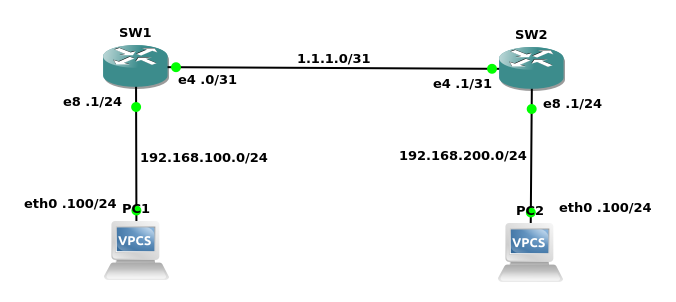

# SONiC GNS3 testbed - unified FRR configuration

This tutorial walks you through setting up and configuring a testbed environment in the GNS3 simulation platform.
The setup includes just two SONiC switches (SW1, SW2) with community images and two PCs connected to them.

The guide also covers an unnumbered BGP L3 underlay configuration using unified FRR and BGP unnumbered.



## Prerequisites

* GNS3
  * Select the installer for your favourite OS: https://www.gns3.com/software/download
* SONiC GNS3 appliance
  * Follow instructions [here](../general.md#gns3-simulation-environment)
  * The tutorial is intended to use SONiC community images. It was tested with community image SONiC master build 656617

## SONiC GNS3 configuration

* Drag and drop the SONiC switches and PCs, and wire them as shown in the architecture diagram
* Remove arbitrary config defaults 
  * The SONiC community image includes a default configuration that enables various ports and assigns arbitrary IP addresses
    to them. Replace this configuration with another default setting that avoids arbitrary configurations.
    For this purpose, we can use a predefined config template:
    ```bash
    sudo su -
    sonic-cfggen  -H --preset l3 -k Force10-S6000 > /etc/sonic/config_db.json
    config reload -y
    ```
* Configure switches
  * Find the FRR unified config files `configs/sw1_frr_unified.json`, `configs/sw1_frr_unified.json`, and apply them as follows:
  ```bash
  # copy  <sonic-sw>_frr_unified.json file to the switch
  sudo config load <sonic-sw>_frr_unified.json -y
  docker restart bgp
  # if you want to make the config persistent save it to the /etc/sonic.config_db.json
  sudo config save -y
  ```
* Configure PC1 and PC2
  * Configure PC's IP address and proper gateway
  ```text
  PC1> ip 192.168.100.100/24 192.168.100.1
  PC2> ip 192.168.200.100/24 192.168.200.1
  ```

## Validate the testbed

* Validate the interfaces' setup
  * Connect to, for example, the switch 1 console (the default credential for login is admin/YourPaSsWoRd) and verify
    the IPv6 link local mode is enabled for Ethernet4 (due to BGP unnumbered, for details read e.g. [this](https://support.edge-core.com/hc/en-us/articles/900002377366--Enterprise-SONiC-BGP-Unnumbered))
  ```yaml
  $ show ipv6 link-local-mode  | grep Enabled
  | Ethernet4        | Enabled  |
  ```
  * Validate whether you see UP/UP state of connected interfaces via e.g. `$ show int status`
  * Explore interfaces configuration via `show runningconfiguration interfaces` or via `sudo cat /etc/sonic/config_db.json`
* Validate the BGP configuration
  * Connect to, for example, the Spine switch and verify the routes propagated by the BGP protocol
  ```bash
  $ show ip route
  Codes: K - kernel route, C - connected, S - static, R - RIP,
         O - OSPF, I - IS-IS, B - BGP, E - EIGRP, N - NHRP,
         T - Table, v - VNC, V - VNC-Direct, A - Babel, D - SHARP,
         F - PBR, f - OpenFabric,
         > - selected route, * - FIB route, q - queued route, r - rejected route
  
  C>*10.0.0.1/32 is directly connected, Loopback0, 03:02:15
  B>*10.0.0.2/32 [20/0] via fe80::2047:61ff:feb2:b715, Ethernet4, 03:01:59
  C>*10.1.0.1/32 is directly connected, Loopback0, 03:02:15
  C>*192.168.100.0/24 is directly connected, Ethernet8, 03:02:15
  B>*192.168.200.0/24 [20/0] via fe80::2047:61ff:feb2:b715, Ethernet4, 03:01:59
  ```
  * Explore BGP configuration via `show runningconfiguration bgp`
* Open console of the PC1 or PC2 and try to `ping` the whole infrastructure
  * SONiC switches should be reachable e.g. via its Loopback IPs and PC1 via 192.168.100.100 and PC2 via IP 192.168.200.100
